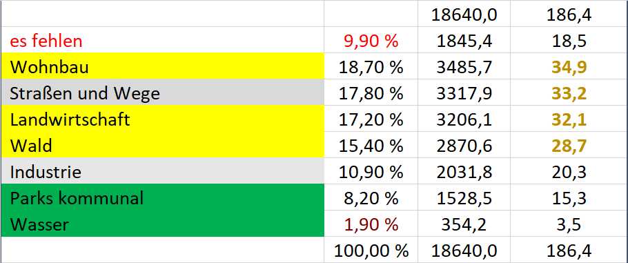

# Dokumentation Gruppe 2 in Nürnberg

## Informationen

- KOMMT BALD

### Weiterführende Links und Materialien

- KOMMT BALD

## Projektdokumentation

Hier findet ihr Leitfragen für die Dokumentation eures Projektes. Code könnt ihr in diesem Repository ablegen: <https://github.com/okfde/Umweltdatenwerkstatt>

- Projekttitel: UnsealingSoil
- Projektteam: Lukas, Gerhard, Max
- Projektziel: Was möchte euer Vorhaben konkret erreichen?   
  Ermitteln von negativen Emission einer Stadt am Beispiel von Nürnberg
- Zielgruppe: Wem nützt euer Vorhaben?   
  Stadtplanung
- Welche Datensätze werden verwendet? (genauer in der Dokumentation der beiden Ansätze)
  - Open Street Maps
  - Zur Validierung (Flächen- und Raumdaten deutschlandweit): <https://www.statistikportal.de/de/ugrdl/ergebnisse/flaeche-und-raum#alle-ergebnisse>
- Welchen Lösungsweg habt ihr gefunden? 
  - Es gibt zwei Ansätze:
    - Ansatz 1: Eine Karte, auf der von Nutzenden Flächen markiert werden können, die anhand eines Faktors berechnet am Ende das Entsiegelungspotenzial ergeben. 
    - Ansatz 2: Anhand von OpenStreeetMap-Daten (GEO-Daten) das Entsiegelungspotenzial durch Ausschluss von definierten Flächen berechnen (Straßen, Wohnhäuser, Bahnanlagen etc). 
- Weiterführende Links:
  - Präsentation zu Analyseverfahren zur Feststellung der Flächennutzung: <https://www.ioer-monitor.de/fileadmin/user_upload/monitor/DFNS/2012_4_DFNS/Praesentationen/Heldens_Wieke-4.DFNS.pdf>
  - Das Liegenschaftskataster in Bayern (closed): <https://ldbv.bayern.de/vermessung/kataster/allgemein.html>
  - <https://www.nabu.de/umwelt-und-ressourcen/bauen/hintergrund/innenentwicklungversusgr%C3%BCn.html>
  - <https://solar-gruendach-nuernberg.ipsyscon.de/#null>
  - Kataster für die Sonnennutzung (Dachbegrünung bei Flachdächern), PV Kataster  
    <https://www.nuernberg.de/presse/mitteilungen/pm_7906.html>  
    [https://www.nuernberg.de/internet/klimaschutz/](https://solar-gruendach-nuernberg.ipsyscon.de/#null)

### Ansatz 2

**Warum entsiegeln**

- CO2 Reduktion durch Bepflanzung
- Versickern von Wasser / Grundwasser –> Schwammstadt, Wasser binden in Pflanzen
- Wohlbefinden in der Stadt  
  <https://www.google.com/search?q=beton+in+st%C3%A4dten+mach+depressiv+studie>
- Bodenfruchtbarkeit
- Luftreinhaltung
- Lärmreduktion

**Hemmnisse**

- Initiale Kosten, Pflege-Aspekt
- Wettbewerb zwischen Natur und Neubau durch Nachverdichtung

**Vorgehen**

1. Datenauswahl
2. Datenvalidierung (Prüfen ob die Flächen/Prozentwerte ca. den Kennwerten entsprechen)
3. Methodik definieren um das Entsiegelungs-Potential zu erkennen
4. Erster Prototyp

**Spätere Schritte:** 

- Dachbegrünung, wenn Daten der Gebäude verfügbar
- Daten Bodenversiegelung basierend auf Daten erhoben bei der Grundsteuererfassung
- Daten Prüfen:
  - Unterschied zwischen Water und Waterways
- Begrünung von verkehrsberuhigten Zonen, z.B. mit Verkehrsdaten 

**Methode**

1. Beschränken bzw Flächen voneinander abziehen: Gesamtfläche - Wasser - Straßen - ...

       –> Prozentsatz, Gesamtfläche berechnen & Flächen Visualisieren, CO2-Einsparung

1. Unterscheiden: Welche Art von Entsiegelung / Begrünung ist möglich

**Arten der Entsiegelung = Begrünung**

1. Komplette Entsiegelung, z.B. bebaute Flächen Gebäude und Industrie in Grünflächen wandeln
2. (Teil-) Überlagerung von 
   1. Wohn-Nutzflächen mit Grün, z.B. Dach begrünen, Fassaden begrünen
   2. Verkehrsflächen und Grün, z.B. Lochsteine
3. Klimatechnische Aufwertung: Flächen die Wald oder Wiese waren und Moor werden können 

**Zusammanhang Ort, Pflanze und CO2 Speicherung, Defaultlink  \[1\],**   
**(x) bezieht sich Arten der Entsiegelung**

| Quelle | Detail | Pflanze | CO2 von  \[t/ha\]\* | CO2 bis  \[t/ha\]\* | Link / Kommentar |
|--------|--------|---------|-----------------|-----------------|:----------------:|
| Wohn- Nutzgebäude (2) | Dach | Moos | 14 | 22 | sehr effektiv |
|  | Dach | Seedum | 7 | 8 | neu |
| Verkehrswege (2) | Einfahrten | Lochsteine mit Gras | 7 |  |  |
| Wald, Acker (3) | ehemals Flachmoor | Moor | 10 |  | \[3\], höhere Werte für Moor? |
| Versigelte Flächen (1) |   | Wiese | 19 | 44 |  |
|  |  | Bäume | 14 |  |  |

\*\[t/ha/Jahr\]

  
\[1\] [F002_co2_bindung.pdf]()](https://www.gebaeudegruen.info/fileadmin/website/downloads/bugg-untersuchungen/F002_co2_bindung.pdf]\(\))

\[2\] <https://www.umwelt.nrw.de/fileadmin/redaktion/PDFs/klima/gutachten_fassadenbegruenung.pdf>

\[3\] <https://www.biooekonomie-bw.de/fachbeitrag/aktuell/klimaschutzfaktor-moore-co2-binden-statt-freisetzen>

**Flächennutzung in Nürnberg**

Diese Daten können zur Validierung herangezogen werden siehe

Gelb wird noch nicht bearbeitet wegen felhlender Daten;   
Grau wird bearbeitet;   
Grün ist schon Natur;

#### Kriterien für Begrünung

Vorgehen zur Festlegung von Kriterien, um automatisiert und mittels GEO-Daten auf OpenStreetMap ein Entsiegelungspotenzial festzustellen

**Was ist schon grün/begrünt oder entsiegelt? = Natur** 

**Was ist versiegelt und kann nicht entsiegelt werden?**

1. Gebäude (Wohn & Gewerbe)
2. Verkehrswege: Straßen, Wege, Schienen, Parkplätze

**Was ist versiegelt und was kann entsiegelt werden?**

1. Gebäude: Industrieanlagen
2. Verkehrswege: Bahnanlagen, Wege, Parkflächen

Teilentsiegelung:  
\- Teile von Verkehrswegen durch Lochsteine oder Hochbeeten  
\- Teile von Gärten

#### Potenziell zu verwendende Daten

- Openstreetmap (einfach zugänglich)
- Niederschlagswassergebührendaten
- Baukatasterdaten
- Ausgewertete Infratrotbilder (wo ist Fläche versiegelt)
- Satellitenbilder
- Kataster für die Sonnennutzung (Dachbegrünung bei Flachdächern), PV Kataster  
  <https://www.nuernberg.de/presse/mitteilungen/pm_7906.html>  
  [https://www.nuernberg.de/internet/klimaschutz/](https://solar-gruendach-nuernberg.ipsyscon.de/#null)

  <https://solar-gruendach-nuernberg.ipsyscon.de/#null>
- Daten von Lostplaces, wie <https://lostplace-map.com/>

#### Vorgehen in anderen Städten/Regionen

- Berlin <https://www.berlin.de/umweltatlas/boden/entsiegelungspotenziale/>
- NRW <https://www.govdata.de/web/guest/daten/-/details/entsiegelungspotenziale>
- BW

#### Datenselektion OpenStreetMap

Hier sind die ausgeschlossenen Flächen aufgeführt, die von der Gesamtfläche (z.B. einer Stadt) abgezogen werden.

- [~~1\.1Aerialway~~](https://wiki.openstreetmap.org/wiki/Map_features#Aerialway)
- [~~1\.2Aeroway~~](https://wiki.openstreetmap.org/wiki/Map_features#Aeroway)
- [~~1\.3Amenity~~](https://wiki.openstreetmap.org/wiki/Map_features#Amenity)
  - [~~1\.3.1Sustenance~~](https://wiki.openstreetmap.org/wiki/Map_features#Sustenance)
  - [~~1\.3.2Education~~](https://wiki.openstreetmap.org/wiki/Map_features#Education)
  - [~~1\.3.3Transportation~~](https://wiki.openstreetmap.org/wiki/Map_features#Transportation)
  - [~~1\.3.4Financial~~](https://wiki.openstreetmap.org/wiki/Map_features#Financial)
  - [~~1\.3.5Healthcare~~](https://wiki.openstreetmap.org/wiki/Map_features#Healthcare)
  - [~~1\.3.6Entertainment, Arts & Culture~~](https://wiki.openstreetmap.org/wiki/Map_features#Entertainment,_Arts_&_Culture)
  - [~~1\.3.7Public Service~~](https://wiki.openstreetmap.org/wiki/Map_features#Public_Service)
  - [~~1\.3.8Facilities~~](https://wiki.openstreetmap.org/wiki/Map_features#Facilities)
  - [~~1\.3.9Waste Management~~](https://wiki.openstreetmap.org/wiki/Map_features#Waste_Management)
  - [~~1\.3.10Others~~](https://wiki.openstreetmap.org/wiki/Map_features#Others)
- [~~1\.4Barrier~~](https://wiki.openstreetmap.org/wiki/Map_features#Barrier)
  - [~~1\.4.1Linear barriers~~](https://wiki.openstreetmap.org/wiki/Map_features#Linear_barriers)
  - [~~1\.4.2Access control on highways~~](https://wiki.openstreetmap.org/wiki/Map_features#Access_control_on_highways)
- [~~1\.5Boundary~~](https://wiki.openstreetmap.org/wiki/Map_features#Boundary)
  - [~~1\.5.1Boundary types~~](https://wiki.openstreetmap.org/wiki/Map_features#Boundary_types)
  - [~~1\.5.2Attributes~~](https://wiki.openstreetmap.org/wiki/Map_features#Attributes)
- [1\.6Building](https://wiki.openstreetmap.org/wiki/Map_features#Building)
  - [~~1\.6.1Accommodation~~](https://wiki.openstreetmap.org/wiki/Map_features#Accommodation)
  - [~~1\.6.2Commercial~~](https://wiki.openstreetmap.org/wiki/Map_features#Commercial)
  - [~~1\.6.3Religious~~](https://wiki.openstreetmap.org/wiki/Map_features#Religious)
  - [~~1\.6.4Civic/amenity~~](https://wiki.openstreetmap.org/wiki/Map_features#Civic/amenity)
  - [~~1\.6.5Agricultural/plant production~~](https://wiki.openstreetmap.org/wiki/Map_features#Agricultural/plant_production)
  - [~~1\.6.6Sports~~](https://wiki.openstreetmap.org/wiki/Map_features#Sports)
  - [~~1\.6.7Storage~~](https://wiki.openstreetmap.org/wiki/Map_features#Storage)
  - [~~1\.6.8Cars~~](https://wiki.openstreetmap.org/wiki/Map_features#Cars)
  - [~~1\.6.9Power/technical buildings~~](https://wiki.openstreetmap.org/wiki/Map_features#Power/technical_buildings)
  - [~~1\.6.10Other buildings~~](https://wiki.openstreetmap.org/wiki/Map_features#Other_buildings)
  - [~~1\.6.11Additional attributes~~](https://wiki.openstreetmap.org/wiki/Map_features#Additional_attributes)
- [~~1\.7Craft~~](https://wiki.openstreetmap.org/wiki/Map_features#Craft)
- [~~1\.8Emergency~~](https://wiki.openstreetmap.org/wiki/Map_features#Emergency)
  - [~~1\.8.1Medical rescue~~](https://wiki.openstreetmap.org/wiki/Map_features#Medical_rescue)
  - [~~1\.8.2Firefighters~~](https://wiki.openstreetmap.org/wiki/Map_features#Firefighters)
  - [~~1\.8.3Lifeguards~~](https://wiki.openstreetmap.org/wiki/Map_features#Lifeguards)
  - [~~1\.8.4Assembly point~~](https://wiki.openstreetmap.org/wiki/Map_features#Assembly_point)
  - [~~1\.8.5Other structure~~](https://wiki.openstreetmap.org/wiki/Map_features#Other_structure)
- [~~1\.9Geological~~](https://wiki.openstreetmap.org/wiki/Map_features#Geological)
- [~~1\.10Healthcare~~](https://wiki.openstreetmap.org/wiki/Map_features#Healthcare_2)
- [1\.11Highway](https://wiki.openstreetmap.org/wiki/Map_features#Highway)
  - [1\.11.1Roads](https://wiki.openstreetmap.org/wiki/Map_features#Roads)
  - [1\.11.2Link roads](https://wiki.openstreetmap.org/wiki/Map_features#Link_roads)
  - [1\.11.3Special road types](https://wiki.openstreetmap.org/wiki/Map_features#Special_road_types)
  - [1\.11.4Paths](https://wiki.openstreetmap.org/wiki/Map_features#Paths)
  - [1\.11.5When sidewalk/crosswalk is tagged as a separate way](https://wiki.openstreetmap.org/wiki/Map_features#When_sidewalk/crosswalk_is_tagged_as_a_separate_way)
  - [1\.11.6When sidewalk (or pavement) is tagged on the main roadway (see Sidewalks)](https://wiki.openstreetmap.org/wiki/Map_features#When_sidewalk_\(or_pavement\)_is_tagged_on_the_main_roadway_\(see_Sidewalks\))
  - [1\.11.7When cycleway is drawn as its own way (see Bicycle)](https://wiki.openstreetmap.org/wiki/Map_features#When_cycleway_is_drawn_as_its_own_way_\(see_Bicycle\))
  - [1\.11.8Cycleway tagged on the main roadway or lane (see Bicycle)](https://wiki.openstreetmap.org/wiki/Map_features#Cycleway_tagged_on_the_main_roadway_or_lane_\(see_Bicycle\))
  - [1\.11.9Street parking tagged on the main roadway (see Street parking)](https://wiki.openstreetmap.org/wiki/Map_features#Street_parking_tagged_on_the_main_roadway_\(see_Street_parking\))
  - [~~1\.11.10Lifecycle (see also lifecycle prefixes)~~](https://wiki.openstreetmap.org/wiki/Map_features#Lifecycle_\(see_also_lifecycle_prefixes\))
  - [~~1\.11.11Attributes~~](https://wiki.openstreetmap.org/wiki/Map_features#Attributes_2)
  - [~~1\.11.12Other highway features~~](https://wiki.openstreetmap.org/wiki/Map_features#Other_highway_features)
- [~~1\.12Historic~~](https://wiki.openstreetmap.org/wiki/Map_features#Historic)
- [1\.13Landuse](https://wiki.openstreetmap.org/wiki/Map_features#Landuse)
  - [1\.13.1Common landuse key values - developed land](https://wiki.openstreetmap.org/wiki/Map_features#Common_landuse_key_values_-_developed_land)
    - landuse commercial  
      landuse construction  
      landuse education  
      landuse fairground	  
      landuse industrial	  
      landuse residential	  
      landuse retail	  
      landuse institutional
  - [1\.13.2Common landuse key values - rural and agricultural land](https://wiki.openstreetmap.org/wiki/Map_features#Common_landuse_key_values_-_rural_and_agricultural_land)
  - [1\.13.3Common landuse key values - waterbody](https://wiki.openstreetmap.org/wiki/Map_features#Common_landuse_key_values_-_waterbody)
  - [1\.13.4Other landuse key values](https://wiki.openstreetmap.org/wiki/Map_features#Other_landuse_key_values)
- [~~1\.14Leisure~~](https://wiki.openstreetmap.org/wiki/Map_features#Leisure)
- [~~1\.15Man made~~](https://wiki.openstreetmap.org/wiki/Map_features#Man_made)
- [~~1\.16Military~~](https://wiki.openstreetmap.org/wiki/Map_features#Military)
- [~~1\.17Natural~~](https://wiki.openstreetmap.org/wiki/Map_features#Natural)
  - [~~1\.17.1Vegetation~~](https://wiki.openstreetmap.org/wiki/Map_features#Vegetation)
  - [~~1\.17.2Water related~~](https://wiki.openstreetmap.org/wiki/Map_features#Water_related)
  - [~~1\.17.3Geology related~~](https://wiki.openstreetmap.org/wiki/Map_features#Geology_related)
- [~~1\.18Office~~](https://wiki.openstreetmap.org/wiki/Map_features#Office)
- [~~1\.19Place~~](https://wiki.openstreetmap.org/wiki/Map_features#Place)
  - [~~1\.19.1Administratively declared places~~](https://wiki.openstreetmap.org/wiki/Map_features#Administratively_declared_places)
  - [~~1\.19.2Populated settlements, urban~~](https://wiki.openstreetmap.org/wiki/Map_features#Populated_settlements,_urban)
  - [~~1\.19.3Populated settlements, urban and rural~~](https://wiki.openstreetmap.org/wiki/Map_features#Populated_settlements,_urban_and_rural)
  - [~~1\.19.4Other places~~](https://wiki.openstreetmap.org/wiki/Map_features#Other_places)
  - [~~1\.19.5Additional attributes~~](https://wiki.openstreetmap.org/wiki/Map_features#Additional_attributes_2)
- [~~1\.20Power~~](https://wiki.openstreetmap.org/wiki/Map_features#Power)
- [~~1\.21Public transport~~](https://wiki.openstreetmap.org/wiki/Map_features#Public_transport)
- [1\.22Railway](https://wiki.openstreetmap.org/wiki/Map_features#Railway)
  - [1\.22.1Tracks](https://wiki.openstreetmap.org/wiki/Map_features#Tracks)
  - [1\.22.2Additional track features or attributes](https://wiki.openstreetmap.org/wiki/Map_features#Additional_track_features_or_attributes)
  - [1\.22.3Stations and stops](https://wiki.openstreetmap.org/wiki/Map_features#Stations_and_stops)
  - [1\.22.4Other railways](https://wiki.openstreetmap.org/wiki/Map_features#Other_railways)
- [~~1\.23Route~~](https://wiki.openstreetmap.org/wiki/Map_features#Route)
- [~~1\.24Shop~~](https://wiki.openstreetmap.org/wiki/Map_features#Shop)
  - [~~1\.24.1Food, beverages~~](https://wiki.openstreetmap.org/wiki/Map_features#Food,_beverages)
  - [~~1\.24.2General store, department store, mall~~](https://wiki.openstreetmap.org/wiki/Map_features#General_store,_department_store,_mall)
  - [~~1\.24.3Clothing, shoes, accessories~~](https://wiki.openstreetmap.org/wiki/Map_features#Clothing,_shoes,_accessories)
  - [~~1\.24.4Discount store, charity~~](https://wiki.openstreetmap.org/wiki/Map_features#Discount_store,_charity)
  - [~~1\.24.5Health and beauty~~](https://wiki.openstreetmap.org/wiki/Map_features#Health_and_beauty)
  - [~~1\.24.6Do-it-yourself, household, building materials, gardening~~](https://wiki.openstreetmap.org/wiki/Map_features#Do-it-yourself,_household,_building_materials,_gardening)
  - [~~1\.24.7Furniture and interior~~](https://wiki.openstreetmap.org/wiki/Map_features#Furniture_and_interior)
  - [~~1\.24.8Electronics~~](https://wiki.openstreetmap.org/wiki/Map_features#Electronics)
  - [~~1\.24.9Outdoors and sport, vehicles~~](https://wiki.openstreetmap.org/wiki/Map_features#Outdoors_and_sport,_vehicles)
  - [~~1\.24.10Art, music, hobbies~~](https://wiki.openstreetmap.org/wiki/Map_features#Art,_music,_hobbies)
  - [~~1\.24.11Stationery, gifts, books, newspapers~~](https://wiki.openstreetmap.org/wiki/Map_features#Stationery,_gifts,_books,_newspapers)
  - [~~1\.24.12Others~~](https://wiki.openstreetmap.org/wiki/Map_features#Others_2)
- [~~1\.25Sport~~](https://wiki.openstreetmap.org/wiki/Map_features#Sport)
- [~~1\.26Telecom~~](https://wiki.openstreetmap.org/wiki/Map_features#Telecom)
- [~~1\.27Tourism~~](https://wiki.openstreetmap.org/wiki/Map_features#Tourism)
- [1\.28Water](https://wiki.openstreetmap.org/wiki/Map_features#Water)
- [~~1\.29Waterway~~](https://wiki.openstreetmap.org/wiki/Map_features#Waterway)
  - [~~1\.29.1Natural watercourses~~](https://wiki.openstreetmap.org/wiki/Map_features#Natural_watercourses)
  - [~~1\.29.2Man-made waterways~~](https://wiki.openstreetmap.org/wiki/Map_features#Man-made_waterways)
  - [~~1\.29.3Facilities~~](https://wiki.openstreetmap.org/wiki/Map_features#Facilities_2)
  - [~~1\.29.4Barriers on waterways~~](https://wiki.openstreetmap.org/wiki/Map_features#Barriers_on_waterways)
  - [~~1\.29.5Other features on waterways~~](https://wiki.openstreetmap.org/wiki/Map_features#Other_features_on_waterways)

- [~~2Additional properties~~](https://wiki.openstreetmap.org/wiki/Map_features#Additional_properties)
  - [~~2\.1Addresses~~](https://wiki.openstreetmap.org/wiki/Map_features#Addresses)
    - [~~2\.1.1Tags for individual houses~~](https://wiki.openstreetmap.org/wiki/Map_features#Tags_for_individual_houses)
    - [~~2\.1.2For countries using hamlet, subdistrict, district, province, state, county~~](https://wiki.openstreetmap.org/wiki/Map_features#For_countries_using_hamlet,_subdistrict,_district,_province,_state,_county)
    - [~~2\.1.3Tags for interpolation ways~~](https://wiki.openstreetmap.org/wiki/Map_features#Tags_for_interpolation_ways)
  - [~~2\.2Annotations~~](https://wiki.openstreetmap.org/wiki/Map_features#Annotations)
  - [~~2\.3Name~~](https://wiki.openstreetmap.org/wiki/Map_features#Name)
  - [~~2\.4Properties~~](https://wiki.openstreetmap.org/wiki/Map_features#Properties)
  - [~~2\.5References~~](https://wiki.openstreetmap.org/wiki/Map_features#References)
  - [~~2\.6Restrictions~~](https://wiki.openstreetmap.org/wiki/Map_features#Restrictions)